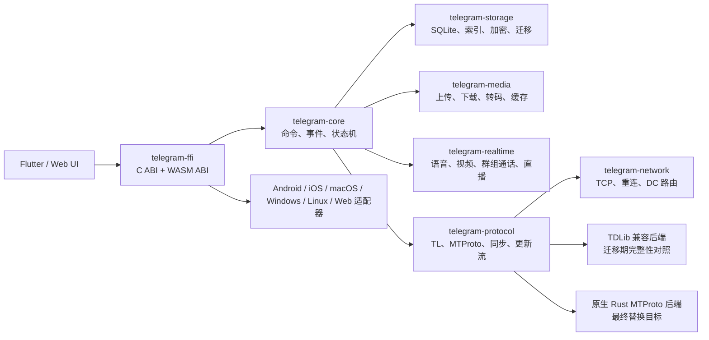

# Telegram 全功能 Rust 迁移基线

更新日期：2026-07-12

## 1. 结论与当前差距

Fabushi 当前已经有 Telegram 风格的响应式壳层、会话列表、Drawer 和机器人聊天界面，但它们不是 Telegram 客户端核心：好友会话仍提示“下一步接入”，消息保存在页面内存，时间和未读状态含占位值，也没有 MTProto/TDLib 协议、离线同步、媒体管线、通话、Secret Chat 或完整群组/频道能力。

因此本迁移采用“协议覆盖可计数、领域行为可回放、每个平台可验收”的方式推进。只有 UI 相似不能标记为功能完成。

## 2. 固定的官方上游

精确 commit 和机器可读许可证记录位于 `native/telegram-core/upstream-pins.json`。本轮固定了 Telegram 官方源码页列出的八个上游：

| 上游 | 用途 | 许可证 | 使用方式 |
| --- | --- | --- | --- |
| TDLib | API 类型、方法、更新顺序、网络/存储行为基线 | Boost 1.0 | 可作为兼容后端与协议验收基准 |
| Android | Android 功能、通知、分享、相机/媒体行为基准 | GPL-2.0-or-later | 只做行为与测试参考 |
| iOS | iOS、扩展、系统分享、CallKit 等行为基准 | GPL-2.0-or-later | 只做行为与测试参考 |
| macOS | 原生 macOS 行为、快捷键和分享扩展基准 | GPL-2.0 | 只做行为与测试参考 |
| Web K / Web A | Web/PWA、浏览器存储和媒体行为基准 | GPL-3.0 | 只做行为与测试参考 |
| Desktop | Windows/macOS/Linux 桌面功能基准 | GPL-3.0（含 OpenSSL 例外） | 只做行为与测试参考 |
| Telegram X | Android 替代交互和性能行为基准 | GPL-3.0 | 只做行为与测试参考 |

协议覆盖采用三层可审计分母：TDLib `td_api.tl` 为 2,126 个类型声明/1,001 个函数声明，Telegram 线协议 `telegram_api.tl` 为 1,631/796，MTProto 核心 `mtproto_api.tl` 为 40/8。三份文件都固定到同一 TDLib commit，并分别校验 SHA-256；精确 digest 记录在 `native/telegram-core/upstream-pins.json`。

## 3. 许可证边界

Telegram 客户端仓库大多为 GPL。逐文件翻译、改写或复制这些客户端实现，通常仍可能构成派生作品并触发 GPL 的源码提供与同许可证义务。Fabushi 仓库根目录目前没有发现统一的顶层许可证，因此在产品许可证作出明确决定前，禁止把 GPL 客户端源码或逐行翻译代码直接提交到现有应用目录。

执行规则：

1. 官方 GPL 客户端只用于功能清单、可观察行为、交互和验收测试参考。
2. Rust 实现基于公开 Telegram API/MTProto 文档、Boost 许可的 TDLib API 合约以及独立设计的领域模型完成。
3. 如果未来确实需要直接派生 GPL 代码，必须放入独立、明确标记的 GPL 分发单元，并同步提供对应源代码和许可证；不能静默混入现有产品。
4. 产品名称、图标、`api_id`、隐私策略和应用商店材料使用自有配置，不冒充 Telegram 官方客户端。

这是一条工程隔离策略，不替代正式法律意见。

## 4. Rust 目标架构

职责边界：

- `telegram-core`：完全不依赖 Flutter 和具体操作系统，定义稳定 ID、会话、消息、命令、事件和确定性 reducer。
- `telegram-protocol`：处理授权状态、TL schema、请求关联、更新顺序、数据中心迁移、重试和限流。
- `telegram-network`：维护 native TCP 连接、传输帧收发、官方 bootstrap DC 回退以及 auth-key 握手编排；Web 复用同一协议层但使用 WebSocket 适配器。
- `telegram-storage`：维护会话、消息、全文索引、下载状态和离线队列；本地敏感数据默认加密。
- `telegram-media`：统一媒体元数据、缩略图、分片上传下载、断点续传、流式播放和缓存预算。
- `telegram-realtime`：负责 VoIP、视频、群组通话、直播和屏幕共享，不与普通消息同步耦合。
- `telegram-ffi`：向 Dart、Swift/Kotlin 平台壳和 WebAssembly 暴露同一 JSON/二进制 ABI。
- 平台适配器：只处理推送、通知动作、相机、相册、系统分享、生物识别、后台任务、窗口、托盘、快捷键和无障碍等系统能力。

## 5. 迁移顺序

### 阶段 A：覆盖契约与消息核心（已启动）

- 固定八个官方上游 commit、许可证和 TDLib schema 摘要。
- 建立 90+ 个稳定功能键，禁止把“已计划”误报为“已实现”。
- 实现跨端统一的消息数据模型和 command/event 状态机。
- 为临时消息 ID、幂等发送、服务端确认、失败、编辑、删除、已读和置顶建立回放测试。

### 阶段 B：协议与本地数据库

- 生成/解析 TDLib、Telegram API、MTProto 三层全部合约，并分别对 1,001、796、8 个函数建立支持映射。
- 建立授权状态机：手机号、验证码、二维码、二步验证、会话恢复和多账号。
- 建立 SQLite schema、版本迁移、加密密钥、全文索引和离线发送队列。
- 先用隔离的 TDLib 兼容后端做全量行为对照，同时逐域替换为原生 Rust 协议实现。

当前阶段 B 已完成的底座：授权状态机、TL primitive/vector 编解码、四种 MTProto 传输帧、MTProto 2.0 消息加解密与会话序号保护、schema digest/声明数审计、2,458 个线协议 constructor 目录、XChaCha20-Poly1305 加密 SQLite 快照、原子事件日志、C/JSON ABI、Flutter 原生/WASM 调用入口。Android 的 arm64-v8a、armeabi-v7a、x86_64 三个发布 `.so` 已验证目标架构和六个稳定 C ABI 符号；macOS arm64 Release 完整应用已在无签名模式编译链接成功，应用包内动态库的六个 ABI 符号和加载路径均已核验；iOS Simulator 静态库可构建并包含 Swift 强制链接符号；Web 发布包已完成真实加载测试。Linux/Windows 已接入应用构建系统并由跨系统 CI 验证。发布签名仍需要项目配置真实 Apple Development Team 与证书，安全 entitlement 不会为绕过签名而移除。

auth-key 握手的 nonce、PQ 分解、RSA_PAD、临时 AES-IGE、DH 参数校验、auth key/salt 派生与重试状态机已经实现。`telegram-network` 已加入带超时和候选端点回退的 native TCP 连接、分片读取重组和 plaintext 握手编排；官方 bootstrap IPv4/IPv6/端口表固定取自同一 TDLib commit。2026-07-11 的生产环境探测已经由纯 Rust 直接连接 DC2，收到 `dh_gen_ok`，随后使用新密钥完成 MTProto 2.0 加密 ping/pong 的验签与解密，证明双向加密链路真实可用。运行时命令 `telegram.bootstrapTransport` 只在同样的加密 ping/pong 验证通过后返回，并保留内存中的已认证 TCP 会话；UI 只能得到 auth-key ID，不能取得 256-byte 密钥，client 释放时密钥自动清零。`help.getConfig` 动态端点可按主连接、媒体、CDN 和 IPv4/IPv6 选择，303 DC 迁移、420 限流、401 授权失效和 5xx 重试也有确定性路由。

SQLite v2 已增加 XChaCha20-Poly1305 加密消息表与 HMAC-SHA256 盲索引，支持中文/英文检索、会话过滤、编辑删除和 v1 原子迁移，数据库不落消息或搜索词明文。通用加密 RPC 请求关联、service result、消息容器、服务端确认和 bad salt 重试边界已经接入，生产 DC2 的 `get_future_salts` 返回构造器 `0xae500895` 已实网验证。固定 layer 227 的 `invokeWithLayer/initConnection/help.getConfig`、`auth.sendCode`、`auth.signIn`、`auth.signUp`、`account.getPassword`、`auth.checkPassword`、`updates.getState`、`updates.getDifference` 和 `msgs_ack` 已有强类型 Rust 构造器与字节级测试。Config 的 DC 目录、全部当前验证码发送类型、RPC 错误、密码状态、更新游标以及空/过长 difference 已有解析器。

两步验证已按固定 TDLib `PasswordManager.cpp` 的 Boost 许可算法独立实现：SHA-256、PBKDF2-HMAC-SHA512 100,000 次、2048-bit SRP 模幂、服务端 B/prime/g 校验及 M1 证明；密码、派生哈希、随机指数和共享秘密均在 Rust 中清零。运行时在 `SESSION_PASSWORD_NEEDED` 后获取 SRP 参数，不会把密码或密码哈希直接发送给 Telegram。Flutter“Telegram 账号”页面已覆盖手机号、验证码、SRP 密码、新号码注册和更新游标启动，并且只从构建配置读取产品自己的 `TELEGRAM_API_ID/TELEGRAM_API_HASH`；项目不会借用或硬编码官方客户端凭据。

真实账号登录端到端验收仍需要产品自有凭据和测试号码；当前仓库未提供这两项，因此默认自动化只验证字节、密码学、状态机和无账号实网链路。完整 difference 中 User/Chat/Message/Update 的强类型解析、持续更新循环、auth-key 加密恢复、WebSocket/IndexedDB 和离线网络调度仍在实施中。

Flutter 好友会话不再停留在视觉壳层：好友被映射为跨端稳定的 Rust `ChatId`，会话列表读取 Rust 状态中的最后消息、时间和未读数，私聊编辑器直接提交 `queueMessage`，消息气泡读取同一 reducer 返回的状态。原生平台从系统 Keychain/Keystore/credential vault 取得 256 位密钥并打开加密 SQLite；发送在真实 MTProto transport 接通前保持 `pending`，不会伪造服务端成功。Web 当前明确标记为临时会话，等待加密 IndexedDB 接入。

### 阶段 C：基础聊天完整闭环

- 私聊、群组、超级群、频道、Saved Messages、Secret Chat。
- 富文本、回复/引用、转发、编辑、删除、定时/静默/受保护消息。
- 已读、未读、输入状态、草稿、归档、置顶、文件夹、通知设置。
- 联系人、搜索、邀请链接、管理员权限和审核。

### 阶段 D：媒体、社区与商业能力

- 图片、视频、文件、语音、圆形视频、音乐、贴纸、Emoji、GIF、相册、投票和测验。
- Stories、Topics、反应、频道统计、直播。
- Bot、Inline Bot、键盘、Mini App、游戏、Invoice、Stars、Giveaway、Passport。

### 阶段 E：实时通信与平台能力

- 语音/视频通话、群组通话、屏幕共享、直播。
- Android/iOS 推送与后台任务；Apple 分享扩展、CallKit 和 Widgets。
- Windows/macOS/Linux 托盘、全局快捷键、多窗口和系统媒体键。
- Web PWA、Service Worker、浏览器通知、WASM 存储与媒体能力降级。

### 阶段 F：全平台一致性验收

- 每个平台跑同一领域合约测试，并补充平台专属 UI/E2E。
- 弱网、断网、断点续传、崩溃恢复、多设备更新顺序和大数据量性能测试。
- 无障碍、国际化、主题、动态字体、键盘导航和屏幕阅读器验收。
- 对照 pinned 上游逐项关闭功能矩阵，TDLib schema 函数覆盖率达到 100%。

## 6. “完成”的严格定义

一个功能只有同时满足以下条件才可以从 `Planned`/`ContractDefined` 改成 `Implemented`：

1. Rust 领域模型和命令/事件合约存在，并有序列化兼容测试。
2. 协议请求、更新处理、错误与重试路径有自动测试。
3. 本地持久化支持升级、崩溃恢复和离线重放。
4. Android、iOS、macOS、Windows、Linux、Web 均有实现或书面记录的合理平台降级。
5. Flutter/Web UI 不含假数据、占位时间或“下一步接入”提示。
6. 弱网、权限拒绝、账号切换、前后台切换和大文件路径通过验收。
7. 许可证来源和第三方声明可追溯。

在这些条件全部满足前，项目不能宣称“Telegram 所有功能已经迁移完成”。
